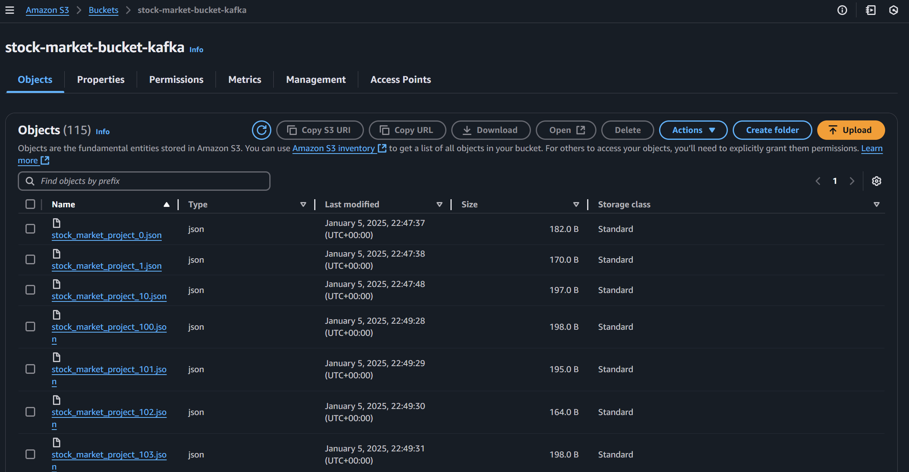
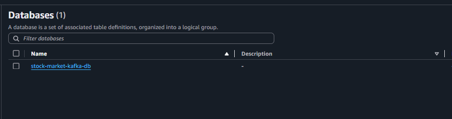
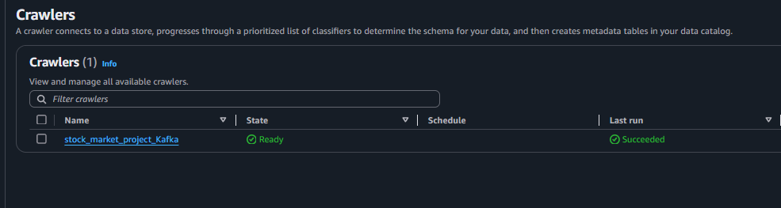
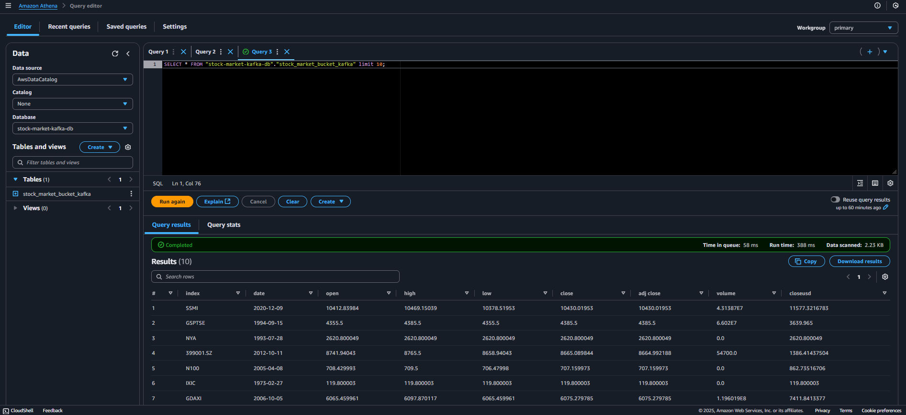

# End-To-End Data Engineering Project on Real-Time Stock Market Data streaming using Kafka

## Overview
In this project, I completed an End-To-End Data Engineering Project on Real-Time Stock Market Data using Kafka. The primary objective was to build a robust data pipeline to handle real-time data processing and below is the pipeline architecture 

## Tech Stack
The project leverages a variety of technologies to achieve its objectives:

- *Programming Language**: Python
- - **Amazon Web Services (AWS)**:
     - S3 (Simple Storage Service)
    - Athena - Glue Crawler
    - Glue Catalog
    - EC2
- **Apache Kafka**
  - Zookeeper

## Dataset 
For this porject, I simulated stock market data from a csv file, which was then sent to the kafka producer and streamed in real time to the kafka consumer.
For reference, the dataset used in this project can be found [here](indexProcessed.csv). 

## Project Structure 
- **Data Ingestion**: Setting up Kafka to collect real-time stock market data. 
- **Data Storage**: Using AWS S3 to store raw data.
- **Data Processing**: Utilizing AWS Glue to catalog and crawl the data.
- **Data Querying**: Using AWS Athena to perform queries on the processed data.
- **Compute Resources**: Running the data pipeline on AWS EC2 instances.

## Setup Instructions 
### Prerequisites 
- AWS account
- Kafka installed and configured
- Zookeeper installed and configured
- Python environment set up

### Steps
1. **Install necessary Python packages**:
2. **Set up Kafka**:
     - Start zookeeper, Kafka server and create the required topics.
3. **Configure AWS Services**:
     - Create S3 buckets for data storage.
     

     - Set up Glue Crawlers and Catalogs.
        

       
     - Configure Athena for querying data.
       
       
4. **Run the Data Pipeline**:
     - Execute the Python scripts to start ingesting and processing data.
     - Monitor the pipeline and ensure data flow from Kafka to S3, Glue, and Athena.
5. **Query the Data**:
   - Use Athena to query the processed data stored in S3 and analyze the stock market trends.
